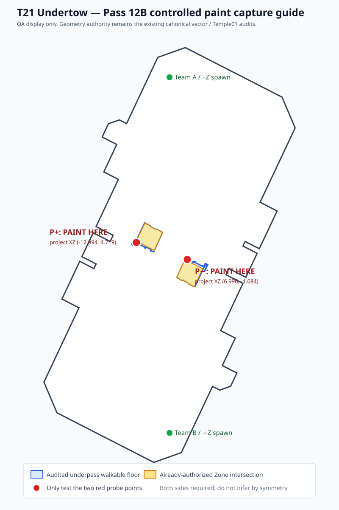

# T21 Undertow — Resolution Pass 12B controlled paint capture guide

This guide is **QA-only display**. It does not create new geometry authority. The outlines are rendered from the already-audited canonical exterior, underpass floor and Splat-Zone intersection coordinates.

## User capture required

Only `UNKNOWN_PAINT_AUTHORITY_SURFACES_PENDING` is request-ready.

Perform **two short current-layout ordinary-ink tests**, one at each red probe point:

1. Show the marked floor patch before firing.
2. Fire ordinary weapon ink directly at that floor patch.
3. Hold the view briefly so it is unambiguous whether a persistent ink patch appears.
4. Keep surrounding underpass geometry visible enough to identify the marked side/location.

Both sides are required. Do not use the already-yellow Zone-intersection floor as the test patch, and do not infer the second side from symmetry.

### Canonical probe coordinates

- positive-Z: project XZ `(-12.994, 4.719)`
- negative-Z: project XZ `(6.996, -1.684)`

The Pass 12B geometry gate verifies both points are inside the audited underpass walkable floor, outside the already-authorized Zone paint intersection, and at least 0.35 m from the nearest relevant polygon boundary.

Glass collision/camera, water/death Y, Turf Scoreable, and final Recast remain deferred until their own isolation/registration prerequisites are met.
