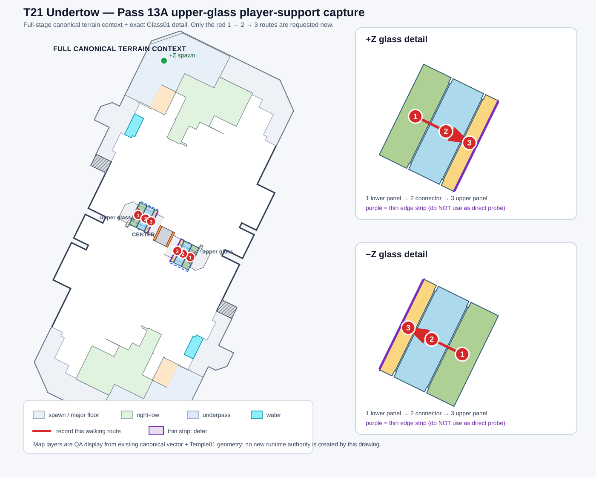

# T21 Undertow — Resolution Pass 13A upper-glass support capture guide

This guide follows the context-rich capture policy. The red instructions are overlaid on the **known full-stage terrain context** (major floor regions, spawn areas, underpass, grates, water and the registered upper-glass family), with two zoomed glass insets. It is QA display only and does not create geometry/collision authority by itself.

## What to record now

Only **PLAYER_SUPPORT_COMPONENT_ROUTE** is request-ready. Projectile and camera-query tests are intentionally deferred until this first capture identifies a reliable player-supporting glass interior.

Record **two short continuous clips total** — one on each mirrored upper-glass structure.

For each side:

1. Start at red **1** (lower glass panel).
2. Walk slowly to red **2** (connector surface).
3. Continue to red **3** (upper glass panel).
4. **Do not jump** across either seam and do not use a movement special.
5. Pause briefly at 1, 2 and 3 so it is clear whether the player is actually supported.
6. Keep the glass frame and nearby floor geometry visible enough to identify which side is being tested.

The two sides must be recorded independently. A failure to stand or a fall at a seam is useful evidence too.

## Important exclusion

The purple thin edge strip beside the upper panel is deliberately **not** part of this capture. Its safe interior clearance is only about 0.046 m, too narrow for a reliable player-footprint probe. It must not be treated as tested merely because point 3 is nearby.

This capture addresses player-support/source binding only. It does **not** establish projectile blocking, camera collision, or Turf Scoreable semantics.
