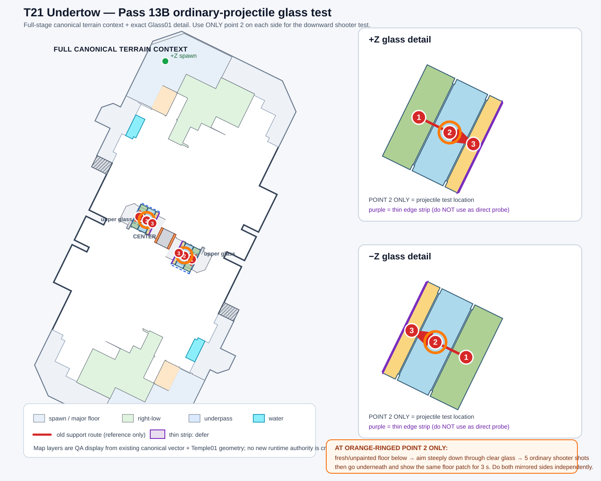

# T21 Undertow — Resolution Pass 13B ordinary-projectile glass test

Pass 13A is complete: both mirrored upper-glass structures support the three broad 1 → 2 → 3 player routes. **Do not repeat that walking test.** This next pass isolates ordinary-main projectile behavior only.

The guide keeps the full canonical terrain context and highlights the exact test position with an **orange ring around point 2** on both glass structures.

## Record two short clips total

Use one mirrored glass structure per clip.

1. Re-enter Recon, or otherwise make sure the lower-floor patch directly below point **2** is still completely unpainted.
2. Use a normal **shooter-type main weapon**. Do not use the roller, a bomb/sub, or a special.
3. Stand at the orange-ringed **2** on the transparent glass interior.
4. Aim steeply downward through the clear glass, keeping the reticle well away from the black frame.
5. Fire a short burst of **5 ordinary main-weapon shots**.
6. Immediately go to the lower underpass and show the same floor patch for **at least 3 seconds**, with nearby pillar/frame landmarks visible.
7. Repeat on the mirrored glass structure.

### How the result is interpreted

- The registered lower-floor target remains clean → the tested ordinary-main projectile is blocked by that glass interior.
- Fresh ink appears on the registered lower-floor target → that projectile passes through.
- Both mirrored sides are judged independently.

This test does **not** establish thrown-sub behavior or camera collision. The purple thin edge strip is still excluded.
