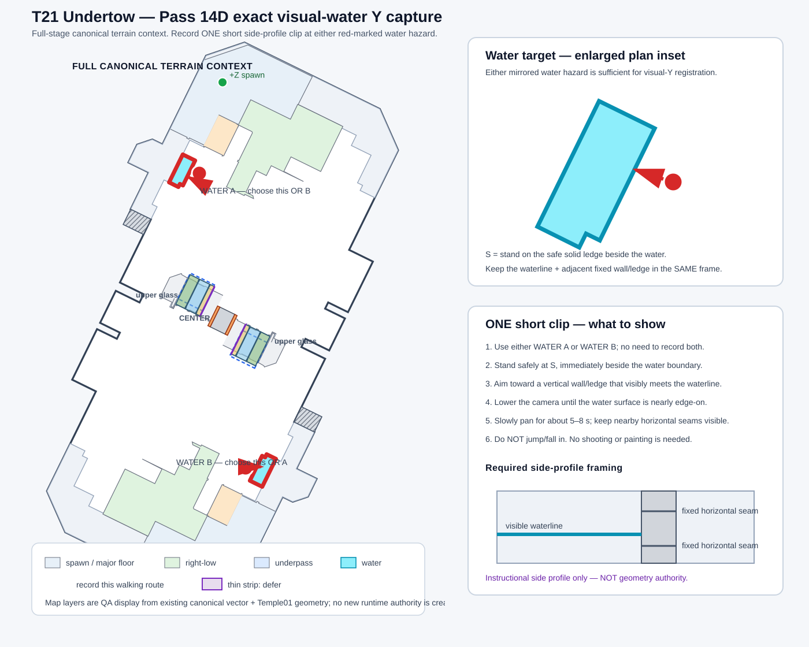

# T21 Undertow — Resolution Pass 14D exact visual-water Y capture guide

## Purpose

**Determine the exact world Y of the visible water surface by registering the in-game waterline against fixed Temple01 geometry whose source Y can be read exactly.**

Source-only Pass 14D auditing found many nearby horizontal Temple01 ledges but no semantically identified water surface, so choosing a Y from geometry alone would be guesswork. Existing received captures do not show the waterline and a suitable fixed side wall/ledge together.

## What to record

Record **one short clip only**. Either of the two red-marked mirrored water hazards is acceptable; Pass 14B already records that both appear to share the same visible height.

1. Stand on the safe solid ledge marked **S** immediately beside the chosen water hazard.
2. Point the camera toward a **vertical fixed wall/ledge that visibly meets the waterline**.
3. Lower the camera until the water surface is close to edge-on rather than looking steeply downward.
4. Slowly pan for about **5–8 seconds**, keeping the waterline, the wall/ledge, and nearby horizontal seams visible together.
5. Do **not** jump or fall into the water. No shooting, painting, sub weapon, or special is needed.

The useful frame is one where the waterline visibly crosses a fixed Temple01 wall/ledge so it can be matched to the exact source-Y ledges enumerated in CI #838.

## What this capture can and cannot resolve

If the waterline registers unambiguously to one exact Temple01 horizontal source level, WATER_VISUAL_Y_PENDING can be cleared.

This clip does **not** by itself set the numeric kill threshold. Passes 14A–14C only establish that death occurs essentially at water contact and in approximately the same height band as exterior fall-out; WATER_KILL_THRESHOLD_PENDING remains separate until its exact numeric placement is justified.
